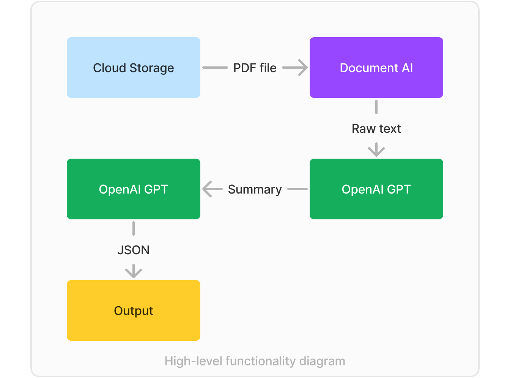

<h1 align="center">Gruba Sprawa API</h1>

## Description
During Legal Hackathon 2024, the idea of an application designed to facilitate work with a large number of digitalised documents was created. This repository is dedicated to the Proof of Concept (POC) for the application’s API. It is responsible for utilising multiple artificial intelligence models to extract text from document scans and return valuable information to the user.

## Technologies used
Here’s the list of technologies we used:
1.	[Spring Boot 3.2.3](https://spring.io/projects/spring-boot)
2.	[Maven 3.9.5](https://maven.apache.org/)
3.	[GCP Cloud Storage](https://cloud.google.com/storage)
4.	[GCP Document AI](https://cloud.google.com/document-ai)
5.	[Azure OpenAI Service](https://azure.microsoft.com/en-us/products/ai-services/openai-service/)
6.	Java client for Google Cloud Storage (https://mvnrepository.com/artifact/com.google.cloud/google-cloud-storage/2.35.0)
(https://cloud.google.com/storage/docs/reference/libraries#client-libraries-install-java)
7.	Java client for Google Cloud Document AI 
(https://mvnrepository.com/artifact/com.google.cloud/google-cloud-document-ai/2.41.0)
(https://cloud.google.com/document-ai/docs/libraries)

## What was achieved
We have managed to create one of the core functionalities: Getting summaries from scanned documents. 
In the beginning, Cloud Storage was set up to store and conveniently access scanned document files. Once a file is retrieved from the storage, it is processed through the Document AI model to extract the text from the scans. The extracted text is then fed into a prompt, directing OpenAI GPT to generate a summary by choosing from predefined templates specified within the prompt. Finally, the generated summary is added to another prompt that instructs GPT to convert it into JSON format. The resulting JSON is delivered to the user.

For an in-depth explanation of the application workflow, see our [wiki page](https://github.com/michaegoroff/legalhack-GS/wiki/Project-docs).

# Authors
- [RostKoff](https://github.com/RostKoff/)
- [michaegoroff](https://github.com/michaegoroff)
